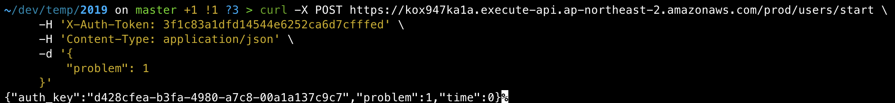

# 2021 카카오 신입공채 2차 온라인 테스트

------

1. Base url - https://kox947ka1a.execute-api.ap-northeast-2.amazonaws.com/prod/users 에 Rest API 호출로 데이터 송수신

    

   * 통신할 서버 띄워져있는지 확인하기
   * 매번 토큰 값 바뀌니 확인 후 변경 사항 반영하기

2. 사전에 JSON parser 준비 -`gson-2.8.8.jar`

3. 로직 개선해 달성률 높이기(효율성보다 우선적), 객체지향 원칙 고려해 코드 리팩토링

  

#### 문제 : https://programmers.co.kr/assignments/23134/challenges/1721

#### 해설: https://tech.kakao.com/2021/02/16/2021-kakao-recruitment-round-2/